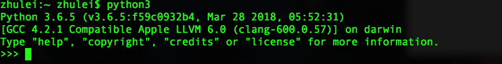
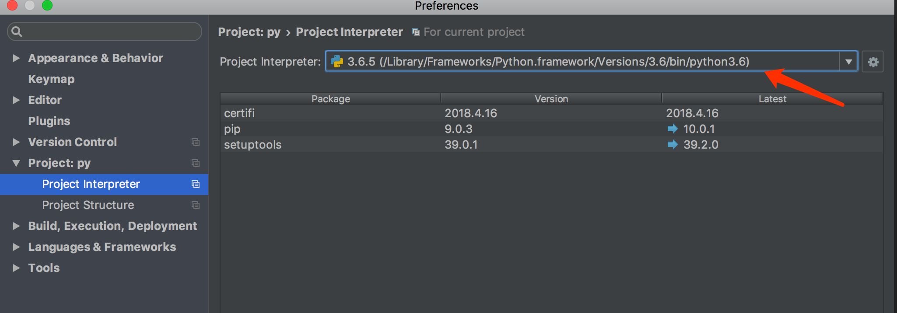

## 在Mac下安装并使用python3

现在Python主要有两个版本：Python2.X和Python3.X。Mac上自带的版本是Python2.7.13（macOS 10.13.4下），那么如果我们要安装Python3.X并使用它怎么办？

<!-- more -->

安装套件管理工具: Homebrew

可以直接点进官网查看安装方式，安装命令：/usr/bin/ruby -e "$(curl -fsSL https://raw.githubusercontent.com/Homebrew/install/master/install)"

安装完可以跑一下：brew --version，如果出现：Homebrew ***证明安装成功了。

安装Python3

一种是直接到Python官网下载，另一种是在终端下输入：brew install python3

安装完之后可以在终端下输入：python3，会出现：

证明安装成功啦。

使用Python3

- 第一种方法是配置环境变量，自行google
- 第二种方法很简单，当使用python2的时候终端里敲上：python，当使用python3的时候终端里敲上：python3

当然，如果你使用PyCharm开发的话，记得配置下项目使用的python版本，如下图：

